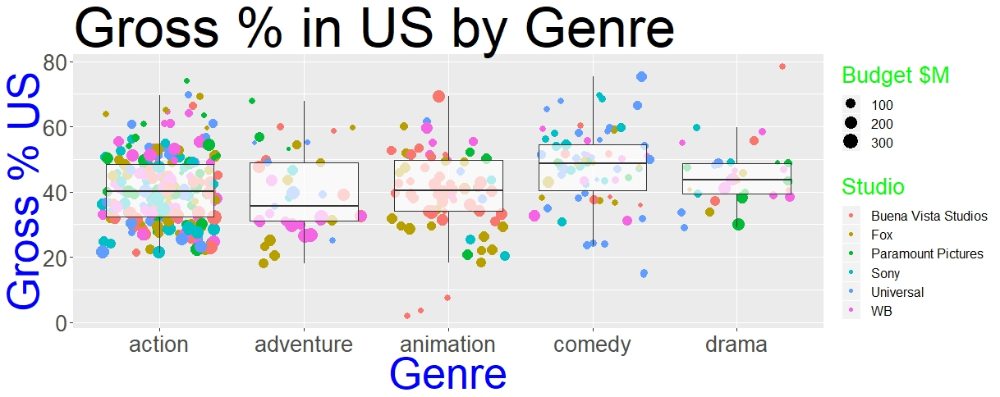

**Movie Data Analysis**

*Shashwat Bhattacharjee*

```{r setup, echo=FALSE, message=FALSE}
setwd("C:/Users/SHASHWAT/Documents/R tutorial 2")
mov <- read.csv("Section6-Homework-Data.csv")
```
**Understanding the Data:**
```{r}
summary(mov) #column summaries
str(mov) #structure of the data
```

**Part 1**  
Observing date of release for various movies:
```{r fig.cap="Figure 1: This is a plot showing the number of movies released on various days of the week"}
library(ggplot2)
plot1<-ggplot(data=mov, aes(x=Day.of.Week)) + geom_bar(aes(fill=Day.of.Week), color="Black")+xlab("Days of the Week")+ylab("Number of movies")
plot1$labels$fill<-"Key"
plot1
```


From the above chart we see that most movies are released on Fridays and some on wednesdays. Another peculiar observation is that no movies have been released on a Monday.  

**Part 2**  
Studying the Gross income of movies according to genre
We need to filter our dataset to leave only the genres and Studios that we are interested in.
```{r}
filt<-(mov$Genre == "action") | (mov$Genre == "adventure") | (mov$Genre == "animation") | (mov$Genre == "comedy") | (mov$Genre == "drama")
filt2 <- (mov$Studio == "Buena Vista Studios") | (mov$Studio == "WB") | (mov$Studio =="Fox") | (mov$Studio =="Universal") | (mov$Studio =="Sony") | (mov$Studio =="Paramount Pictures")
```
Applying the filters:
```{r}
mov2 <- mov[filt & filt2,]
```
Creating the required boxplot for analysis:
```{r fig.cap="Figure 2:This is a boxplot to represent the gross incomes of various movies in accordance to their genre."}
p <- ggplot(data=mov2, aes(x=Genre, y=Gross...US))
q <- p + geom_jitter(aes(colour=Studio,size=Budget...mill.))+geom_boxplot(size=0.5,alpha=0.7,outlier.colour = NA) 
q <- q +xlab("Genre") + ylab("Gross % US") + ggtitle("Gross % in US by Genre")
q <- q + 
  theme(axis.title.x =element_text(colour="Blue",size=20),
              axis.title.y =element_text(colour="Blue",size=20),
              legend.title = element_text(colour = "Green",size=15),
              plot.title = element_text(colour = "Black",size=30),
              axis.text.x= element_text(size=10),
              axis.text.y= element_text(size=10),  
              legend.text= element_text(size=10))
            
q$labels$size = "Budget $M"
q

```

> Observations:  

* Action is the most popular genre in Hollywood with budgets mosty exceeding $200M.    
* Comedy movies have relatively smaller budgets while have the highest overall gross %. This makes producing comedy movies the most profitale venture.  
* Adventure movies have the least gross % making it risky for producers to invest in.  
* Dramas also have a decent gross % but have comparitively larger budgets than comedies.  

*END*
